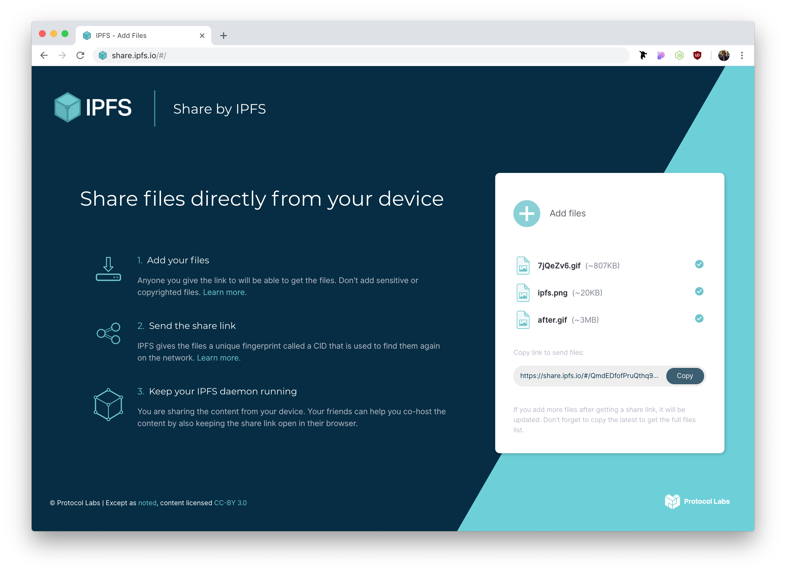

# IPFS Share Files



[](https://protocol.ai/) [](http://ipfs.io/) [](http://webchat.freenode.net/?channels=%23ipfs)
[](http://standardjs.com/)

> Share files via IPFS

## Lead Maintainer

[Diogo Silva](https://github.com/fsdiogo)

## Table of Contents

- [Background](#background)
- [Install](#install)
- [Usage](#usage)
- [Translations](#translations)
- [Contribute](#contribute)
- [License](#license)

## Background

The `IPFS Share Files` is a **work-in-progress**. It is part of the wider [IPFS GUI](https://github.com/ipfs-shipyard/ipfs-gui) project.

The app uses [ipfs-redux-bundle](https://github.com/ipfs-shipyard/ipfs-redux-bundle) to connect to IPFS via multiple providers. An instance of `js-ipfs` is created if no provider is available.

This app is built with [`create-react-app`](https://github.com/facebook/create-react-app). Please read the [docs](https://github.com/facebook/create-react-app/blob/master/packages/react-scripts/template/README.md#table-of-contents).

## Install

With `node@8.12` and `npm@6.4.1` or greater installed, run:

```sh
> npm install
```

## Usage

To run the app in development mode:

```sh
> npm run start
# Go to http://localhost:3000
```

To run the [storybook](https://storybook.js.org/):

```sh
> npm run storybook
# Go to http://localhost:9009
```

Optionally you may have a local IPFS daemon running:

```sh
> ipfs daemon
# API server listening on /ip4/127.0.0.1/tcp/5001
```

### IPFS Daemon

You must configure your IPFS API to allow [cross-origin (CORS)](https://developer.mozilla.org/en-US/docs/Web/HTTP/CORS) requests from you development server and the [share.ipfs.io](https://share.ipfs.io) domain.

You can either run the [cors-config.sh](./cors-config.sh) script:

```sh
> ./cors-config.sh
```

Or do it manually:

```sh
> ipfs config --json API.HTTPHeaders.Access-Control-Allow-Origin '["http://localhost:3000", "https://share.ipfs.io"]'
> ipfs config --json API.HTTPHeaders.Access-Control-Allow-Methods '["PUT", "GET", "POST"]'
```

To reset the config to its default state run:

```sh
> ipfs config --json API.HTTPHeaders {}
```

### Lint

To validate the code using [StandardJS](https://standardjs.com/) run:

```sh
> npm run lint
```

### Build

To build the app for production to the `build` folder:

```sh
> npm run build
```

### Deploy

We use [Jenkins](https://jenkins.io/) for automatic deployments. When a branch gets merged to `master`, it's deployed to [share.ipfs.io](https://share.ipfs.io). When merged to `develop`, it goes to [dev.share.ipfs.io](https://dev.share.ipfs.io).

## Translations

We use [Transifex](https://www.transifex.com/) to help us translate IPFS Share Files. The translations are stored on [`public/locales`](./public/locales) and the English version is the source of truth.

If want to contribute, go to the [project page on Transifex](https://www.transifex.com/ipfs/ipfs-share-files/translate/), create an account, pick a language and start translating!

### How to sync translations

1. Install and set up the [command-line client (` tx `)](https://docs.transifex.com/client/installing-the-client)
2. Download new translations from Transifex with `tx pull -a`
    - this creates/updates the files in [`public/locales/*`](./public/locales) that need to be committed
    - if a new language is created, remember to add it to [`src/i18n.js`](./src/i18n.js)

### How to add or update keys

1. Make sure you have the latest files from Transifex with `tx pull -a`
2. Only change the source file ([`public/locales/en/translation.json`](./public/locales/en/translation.json))
3. Commit your changes
    - changes from the master branch are fetched by Transifex automatically


For more info on our i18n process at IPFS, check out [ipfs/i18n](https://github.com/ipfs/i18n).

## Contribute

Feel free to dive in! [Open an issue](https://github.com/ipfs-shipyard/ipfs-share-files/issues/new) or submit PRs.

To contribute to IPFS in general, see the [contributing guide](https://github.com/ipfs/community/blob/master/CONTRIBUTING.md).

[](https://github.com/ipfs/community/blob/master/CONTRIBUTING.md)

## License

[MIT](LICENSE)
